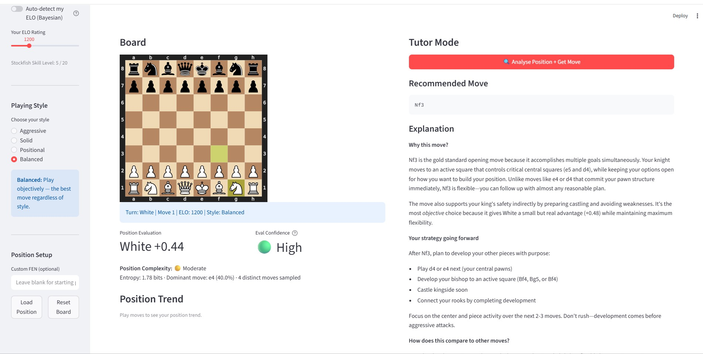
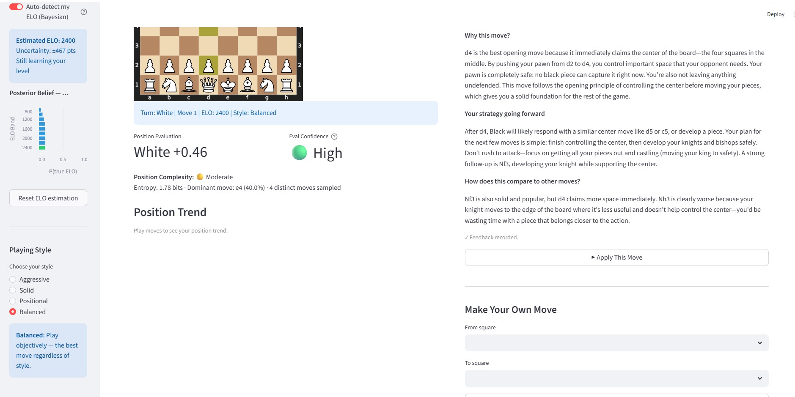
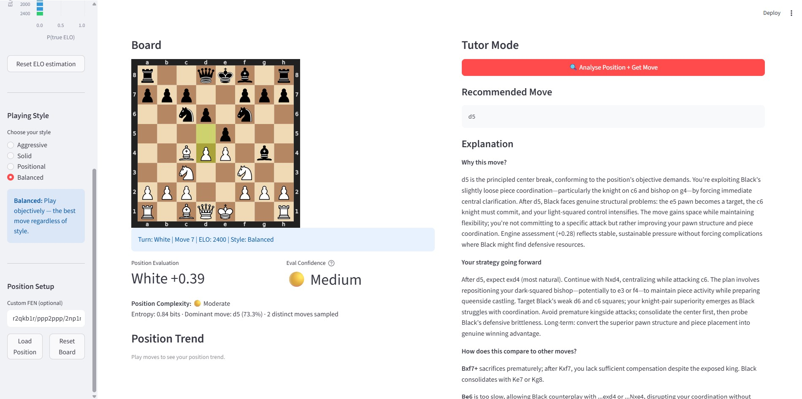
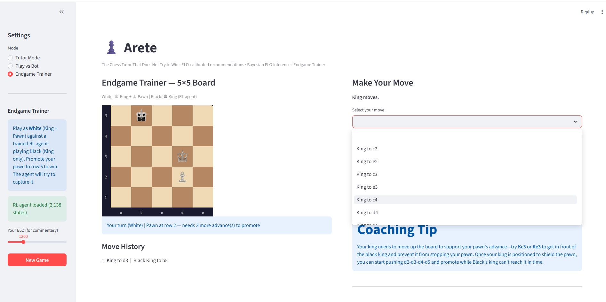
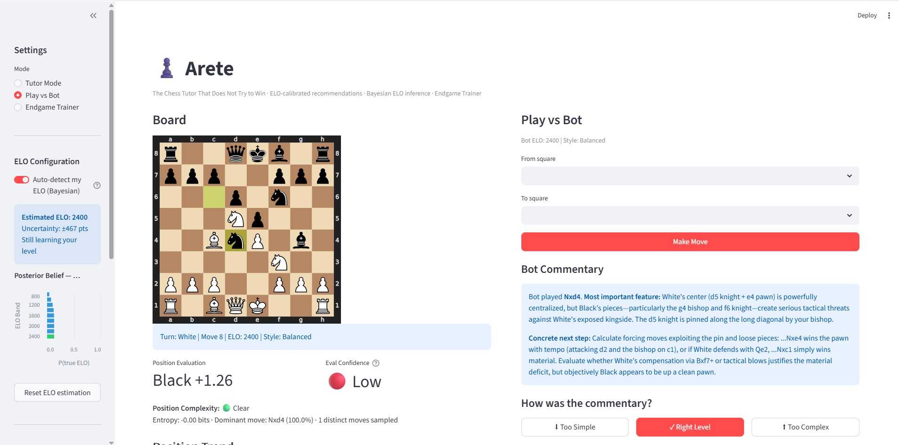
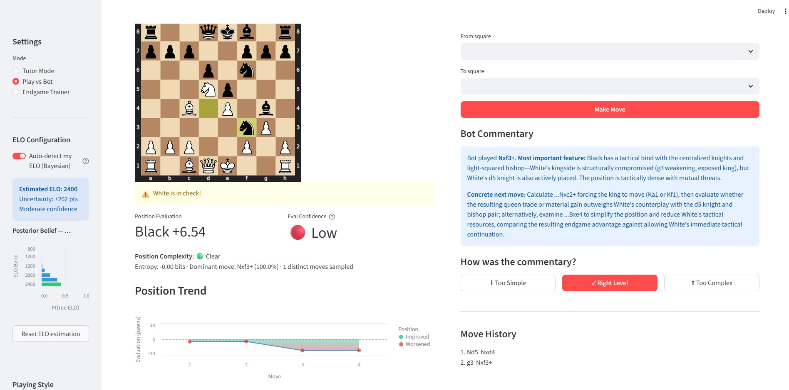

# ♟️ Arete — The Chess Tutor That Does Not Try to Win

**STA561D: Probabilistic Machine Learning | Duke University | Spring 2026**

Arete (from the Greek concept of excellence through practice) is an ELO-calibrated chess tutoring system built around a single inversion: unlike every other chess tool, it is not trying to win. It is trying to help you improve.

The system combines Stockfish move generation, large language model explanation, Bayesian ELO inference, probabilistic position analysis, and a reinforcement learning endgame trainer into a single Streamlit application. Built as a course project for STA561D, it uses chess as a tractable experimental domain for studying how the depth and design of AI-generated recommendations affect the quality of human decision-making.

---

## Screenshots

### Arete — Title and Tagline


### Main Interface — Tutor Mode


### Bayesian ELO Panel


### Position Complexity and Confidence Indicator


### Endgame Trainer


### Play vs Bot Mode


### Position Trend Chart


---

## Architecture

```
sta561-chess-tutor/
├── app.py              # Streamlit UI — all three modes, panels, charts
├── engine.py           # Stockfish interface — moves, evaluation,
│                       # complexity meter, confidence indicator
├── tutor.py            # LLM explanation layer — ELO profiles,
│                       # strategy injection, Bayesian ELO estimator
├── endgame_env.py      # 5x5 King+Pawn RL environment
├── endgame_agent.pkl   # Trained MC Control agent (2,138 states)
├── .env                # API key + Stockfish path (not committed)
├── .env.example        # Template for environment setup
└── notebooks/
    ├── chess_tutor_demo.ipynb
    ├── prompt_strategy_comparison.ipynb
    ├── advanced_experiments.ipynb
    ├── option1_temperature_analysis.ipynb
    ├── option2_bayesian_elo.ipynb
    ├── option3_uncertainty_quantification.ipynb
    └── option4_rl_kingpawn.ipynb
```

---

## Installation

### Prerequisites
- Windows 10/11, macOS, or Linux
- Anaconda or Miniconda
- Stockfish 17+ binary ([download](https://stockfishchess.org/download/))
- Anthropic API key ([console.anthropic.com](https://console.anthropic.com))

### Step 1 — Create environment
```bash
conda create -n chess_tutor python=3.11 -y
conda activate chess_tutor
```

### Step 2 — Install dependencies
```bash
pip install streamlit python-chess anthropic python-dotenv \
            altair pandas scipy scikit-learn textstat matplotlib
```

### Step 3 — Configure .env
Create a `.env` file in the project root based on `.env.example`:
```
ANTHROPIC_API_KEY=your_key_here
STOCKFISH_PATH=path/to/stockfish.exe
```

**Windows example:**
```
STOCKFISH_PATH=D:/stockfish/stockfish-windows-x86-64-avx2.exe
```

**macOS/Linux example:**
```
STOCKFISH_PATH=/usr/local/bin/stockfish
```

### Step 4 — Run the application
```bash
streamlit run app.py
```

Opens automatically at `http://localhost:8501`.

---

## Features

### Mode 1 — Tutor Mode
Analyse any position and receive an ELO-calibrated move recommendation with a structured three-section explanation: why this move, your strategy going forward, and how it compares to alternatives. Both your moves and the opponent's are analysed. You can play against yourself with full analysis on every move, or load any custom position via FEN string.

**How to use:**
1. Set your ELO using the slider or enable Bayesian auto-detection
2. Select a playing style: Aggressive, Solid, Positional, or Balanced
3. Click **Analyse Position + Get Move**
4. Read the explanation, apply the move, or make your own

### Mode 2 — Play vs Bot
Play a full game against Stockfish calibrated to your ELO. The bot provides ELO-appropriate commentary after each of its moves explaining what you should notice and what to look for next.

### Mode 3 — Endgame Trainer
Play a King and Pawn endgame on a compact five-by-five board against a reinforcement learning agent that learned entirely through trial and error across five hundred thousand games with no prior knowledge of chess strategy. Your goal is to promote the pawn to the back rank. The agent's goal is to capture it. Request a coaching tip at any point for position-specific guidance calibrated to your skill level.

---

## Probabilistic Features

### Bayesian ELO Auto-Detection
Toggle **Auto-detect my ELO** in the sidebar. After each explanation, rate it as Too Simple, Right Level, or Too Complex. The system updates a posterior probability distribution over nine ELO bands using Bayes' rule and adjusts future explanations to the new MAP estimate. The posterior chart updates live. After 8 to 12 responses, uncertainty drops by approximately 80%.

**What to observe:** The bar chart shifts right (higher ELO bands) after Too Simple and left after Too Complex. The uncertainty estimate in ELO points decreases with each round.

### Position Complexity Meter
Computed automatically on each analysis. Stockfish is sampled 15 times and Shannon entropy of the move distribution is computed. High entropy means many plausible moves exist — the position is genuinely complex and the explanation will be more abstract. Low entropy means one move dominates — the position is clear and the recommendation is well-grounded.

Labels: Clear (H < 0.8 bits), Moderate (0.8 to 1.8 bits), Complex (H > 1.8 bits).

### Evaluation Confidence Indicator
Compares Stockfish evaluation at search depth 5 versus depth 15. A large gap means the position contains tactical complications that only emerge with deeper calculation. Shown alongside the centipawn evaluation so you know when to trust the recommendation and when to think harder.

Labels: High (gap < 0.3 pawns), Medium (0.3 to 0.8 pawns), Low (gap > 0.8 pawns).

### Position Trend Chart
Updates after every move. Green points mark moves that improved the position. Red points mark moves that worsened it. No numbers to interpret.

---

## What to Test

Run through these in order to verify all features are working:

1. **Tutor Mode baseline** — load starting position, click Analyse, confirm explanation appears with three labelled sections
2. **ELO slider** — set to 800, get explanation, set to 1800, get explanation — confirm language changes substantially
3. **Style selector** — switch from Balanced to Aggressive, confirm explanation framing shifts
4. **Complexity meter** — load FEN `r2qkb1r/ppp2ppp/2np1n2/4p3/2BPP1b1/2N2N2/PPP2PPP/R1BQK2R w KQkq - 0 7`, analyse, confirm Complex label appears
5. **Confidence indicator** — same position, confirm Low or Medium confidence shown next to evaluation
6. **Bayesian panel** — toggle Auto-detect, get explanation, click Too Simple, confirm posterior shifts right and MAP estimate increases
7. **Play vs Bot** — make a move, confirm bot responds with commentary
8. **Evaluation chart** — apply 4 to 5 moves, confirm chart updates with green and red points
9. **Custom FEN** — paste any valid FEN, click Load Position, confirm board updates
10. **Endgame Trainer** — click New Game, confirm 5x5 board appears with RL agent loaded confirmation, make a move, confirm agent responds, click Get coaching tip

---

## Notebooks

All notebooks are self-contained and runnable in the `chess_tutor` conda environment.

| Notebook | Purpose | Approx runtime |
|----------|---------|----------------|
| `chess_tutor_demo.ipynb` | Readability analysis across ELO bands | 3 min |
| `prompt_strategy_comparison.ipynb` | Four prompt strategies compared on calibration quality | 5 min |
| `advanced_experiments.ipynb` | ELO recovery, strategy-ELO interaction, positional faithfulness | 10 min |
| `option1_temperature_analysis.ipynb` | Shannon entropy of move distribution vs Skill Level | 8 min |
| `option2_bayesian_elo.ipynb` | Bayesian ELO estimator validation across ELO bands | 5 min |
| `option3_uncertainty_quantification.ipynb` | Depth-variance uncertainty across position types | 3 min |
| `option4_rl_kingpawn.ipynb` | MC Control King+Pawn endgame with randomised starts | 6 min |

To run any notebook:
```bash
conda activate chess_tutor
cd path/to/sta561-chess-tutor
jupyter notebook notebooks/<notebook_name>.ipynb
```

---

## Environment Variables

| Variable | Description |
|----------|-------------|
| `ANTHROPIC_API_KEY` | Anthropic API key from console.anthropic.com |
| `STOCKFISH_PATH` | Full path to Stockfish binary |

Never commit your `.env` file. Use `.env.example` as a template.

---

## Cost Estimate

All LLM calls use Claude Haiku — Anthropic's most efficient model.

| Activity | Approximate cost |
|----------|-----------------|
| Per explanation call | Less than $0.01 |
| Full development and testing | $3 to $5 |
| Running all notebooks once | Less than $1 |
| Typical demo session (20 moves) | Less than $0.20 |

---

## Key Results

| Experiment | Finding |
|-----------|---------|
| Temperature analysis | Spearman ρ = -0.905 between Skill Level and move entropy — temperature hypothesis confirmed |
| Bayesian ELO estimation | 100% within one ELO band after 20 rounds, 80% uncertainty reduction |
| Readability baseline | 4.6 FK grade levels across ELO bands — surface calibration confirmed |
| ELO recovery | 25% accuracy — semantic depth does not calibrate as cleanly as surface readability |
| RL endgame agent | 97.6% win rate, 2,138 states visited, generalises to unseen positions |

---

## Future Work

1. Full RL-based move generation engine learning ELO-appropriate play through self-play — the King and Pawn demo is the proof of concept
2. Maia Chess integration as the near-term step — trained on 12 million human games at each skill level
3. Hybrid prompt combining structured vocabulary rules with persona framing
4. Post-match analysis identifying strongest and weakest decisions
5. Click-to-move board interaction
6. Persistent player profiles tracking ELO history across sessions

---

## Dependencies

```
streamlit
python-chess
anthropic
python-dotenv
altair
pandas
scipy
scikit-learn
textstat
matplotlib
```

---

*STA561D: Probabilistic Machine Learning | Duke University | Spring 2026*
